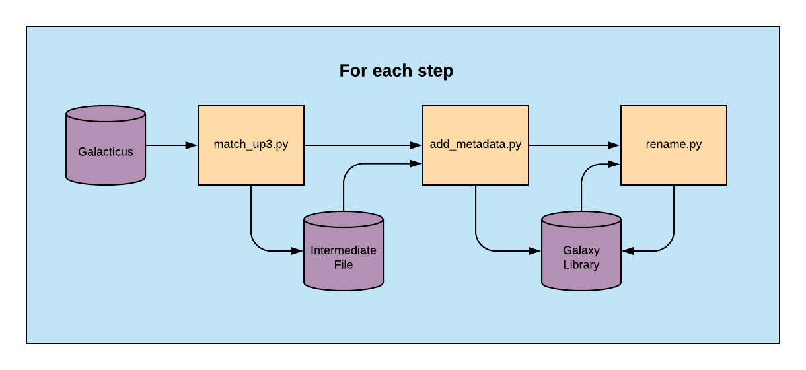

Galacticus Library 
==================

There are three main scripts to produce the library, they chain call
each other if the .param file has `auto` set to true. All three
scripts take in the same .param file as an argument. 

Quick Start Guide
-----------------

An example scripts and parameter files can be found in
`param/gltcs_library_low[high]_z`. The `make_param.sh` script creates
.param files for the run from the `param.template`. The main thing to
change in the template file:

* `gltcs_file_list` : list[string]
  - the explicit list of all Galacticus hdf5
    files. `get_gltcs_list.sh` script can get all `*.hdf5` files from
    a specified search folder. 
	
* `output` : string
  - output file location for the library. The file final library will
    append a `_mod` to the file. 
	
Calling `login_run_all.sh` or `submit_all.sh` will call the pipeline
for each time step.

